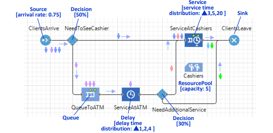

## Project Description
An assignment from my _Business Analytics_ class at UCSD referenced a problem from _The Big Book of Simulation Modeling_ by Borshchev & Grigoryev (2020). To solve the problem, I wrote an in-depth simulation with python to model the scenario parameters and demonstrate the resulting outcome.

### Problem Details

Consider a bank with an ATM inside. The process in the bank is described as follows:

- On average, 45 clients per hour enter the bank.
- Having entered the bank, half of the clients go to the ATM, and the other half go straight to the cashiers.
- Usage of the ATM has a minimum duration of 1 minute, a maximum of 4 minutes, and a most likely duration of 2 minutes.
- Service with a cashier takes a minimum of 3 minutes and a maximum of 20 minutes, with a most likely duration of 5 minutes.
- After using the ATM, 30% of the clients go to the cashiers. The others exit the bank.
- There are 5 cashiers in the bank, and there is a single shared queue for all the cashiers.
- After being served by a cashier, clients exit the bank.

We need to find out the:

- Utilization of cashiers,
- Average queue lengths, both to the ATM and to the cashiers, and the
- Distribution of time spent by a customer in the bank.

### Process Flowchart

  


## Simulation

The simulator is available to use below. You may adjust the average clients per minute and the number of trials (clients) simulated.

### Simulation Code

:::: {.callout-note collapse="true"}
### Expand to view python code
```{python}
#| execute: false
def sim_flow_time(lam, simulations = 100000):
    def pop_cust(lst, person):
        for i, d in enumerate(lst):
            if d.get('cashier') == person:
                return lst.pop(i)
            
        return {'flow': None, 'wait': None}

    def find_cashier_or_enter_queue(cust_num, now, flow_time, wait_time, ATM_cust = False):
            instant = False
            for person in cashiers:
                if cashiers[person]['occupied'] == False:
                    cashiers[person]['occupied'] = True
                    cashier_serv_time = np.random.triangular(cmn, cmd, cmx)
                    cashiers[person]['time_left'] = cashier_serv_time
                    cashiers[person]['served'] += 1
                    instant = True
                    flow_time += cashier_serv_time
                    service = {'id': cust_num, 'cashier': person, 'flow': flow_time, 'wait': wait_time, 'ATM_cust': ATM_cust}
                    with_cashier.append(service)
                    break
            if instant == False:
                waiting = {'id': cust_num, 'q_entry': now, 'flow': flow_time, 'wait': wait_time, 'ATM_cust': ATM_cust}
                cashier_queue.append(waiting)
                cashier_queue_lens.append(len(cashier_queue))

    def use_atm_or_enter_queue(cust_num, now, flow_time, wait_time):
        if ATM['occupied'] == False:
            ATM['occupied'] = True
            atm_serv_time = np.random.triangular(amn, amd, amx)
            ATM['time_left'] = atm_serv_time
            ATM['served'] += 1

            flow_time += atm_serv_time
            usage = {'id': cust_num, 'flow': flow_time, 'wait': wait_time, 'ATM_cust': True}
            at_atm.append(usage)
                
        else:
            waiting = {'id': cust_num, 'q_entry': now, 'flow': flow_time, 'wait': wait_time}
            atm_queue.append(waiting)
            atm_queue_lens.append(len(atm_queue))
    
    avg_cust_per_min = lam
    avg_int_time = 1 / avg_cust_per_min

    # parameters from prompt
    cmn = 3
    cmd = 5
    cmx = 20

    amn = 1
    amd = 2
    amx = 4

    direct_to_cashier = 0.50
    from_atm_to_cashier = 0.30

    # initialize lists and variables for collecting simulation data
    flow_times = []
    wait_times = []
    cashier_queue_lens = [] 
    atm_queue_lens = [] 
    completed = []

    cashiers = {
        'A': {'occupied': False, 'time_left': 0, 'served': 0},
        'B': {'occupied': False, 'time_left': 0, 'served': 0},
        'C': {'occupied': False, 'time_left': 0, 'served': 0},
        'D': {'occupied': False, 'time_left': 0, 'served': 0},
        'E': {'occupied': False, 'time_left': 0, 'served': 0}
    }
    ATM = {'occupied': False, 'time_left': 0, 'served': 0}

    total_time = 0
    cust_num = 0

    cashier_queue = []
    with_cashier = []

    atm_queue = []
    at_atm = []

    # Simulation - each simulation is a new customer entering the bank
    for _ in range(simulations):
        flow_time = 0
        wait_time = 0

        since_last_cust = np.random.exponential(avg_int_time)

        # break up time since last customer into chunks of minimum service time (cashier or ATM) 
        # cycle through cashiers & atm to catch up on in-progress customers
        dm = divmod(since_last_cust, min(cmn, amn))
        catch_up = [1] * int(dm[0]) + [round(dm[1], 4)]
        for chunk in catch_up:

            total_time += chunk

            sorted_items = sorted(cashiers.items(), key=lambda item: item[1]["time_left"])
            cashiers = dict(sorted_items)

            for person in cashiers:
                if cashiers[person]['occupied'] == True:
                    cashiers[person]['time_left'] -= chunk
                    if cashiers[person]['time_left'] <= 0:
                        leaving = pop_cust(with_cashier, person)
                        flow_times.append(leaving['flow'])
                        wait_times.append(leaving['wait'])
                        completed.append(leaving)

                        if len(cashier_queue) > 0:
                            retro = -cashiers[person]['time_left']
                            cashier_serv_time = np.random.triangular(cmn, cmd, cmx)

                            next = cashier_queue.pop(0)
                            cq_time = (total_time - retro - next['q_entry'])
                            wait_time = cq_time + next['wait']
                            flow_time = cashier_serv_time + cq_time + next['flow']
                            service = {'id': next['id'], 'cashier': person, 'flow': flow_time, 'wait': wait_time, 'ATM_cust': next['ATM_cust']}
                            with_cashier.append(service)

                            cashiers[person]['time_left'] = cashier_serv_time - retro
                            cashiers[person]['served'] += 1
                        else:
                            cashiers[person]['occupied'] = False
                            cashiers[person]['time_left'] = 0
                else:
                    if len(cashier_queue) > 0:
                        cashier_serv_time = np.random.triangular(cmn, cmd, cmx)

                        next = cashier_queue.pop(0)
                        cq_time = (total_time - next['q_entry'])
                        wait_time = cq_time + next['wait']
                        flow_time = cashier_serv_time + cq_time + next['flow']
                        service = {'id': next['id'], 'cashier': person, 'flow': flow_time, 'wait': wait_time, 'ATM_cust': next['ATM_cust']}
                        with_cashier.append(service)

                        cashiers[person]['time_left'] = cashier_serv_time
                        cashiers[person]['served'] += 1
                    else:
                        cashiers[person]['occupied'] = False
                        cashiers[person]['time_left'] = 0

            if ATM['occupied'] == True:
                ATM['time_left'] -= chunk
                if ATM['time_left'] <= 0:
                    moving = at_atm.pop(0)
                    decision_2 = np.random.rand()  # go to cashier or leave
                    retro = -ATM['time_left']
                    
                    if decision_2 < from_atm_to_cashier:  # go to cashier
                        now = total_time - retro
                        find_cashier_or_enter_queue(moving['id'], now, moving['flow'], moving['wait'], ATM_cust = True)
                    else:                                 # leave
                        flow_times.append(moving['flow'])
                        wait_times.append(moving['wait'])
                        completed.append(moving)

                    if len(atm_queue) > 0:
                        atm_serv_time = np.random.triangular(amn, amd, amx)

                        next = atm_queue.pop(0)
                        aq_time = (total_time - retro - next['q_entry'])
                        wait_time = aq_time + next['wait']
                        flow_time = atm_serv_time + aq_time + next['flow']
                        usage = {'id': next['id'], 'flow': flow_time, 'wait': wait_time, 'ATM_cust': True}
                        at_atm.append(usage)
                        ATM['time_left'] = atm_serv_time - retro
                        ATM['served'] += 1
                    else:
                        ATM['occupied'] = False
                        ATM['time_left'] = 0
            else:
                if len(atm_queue) > 0:
                    atm_serv_time = np.random.triangular(amn, amd, amx)

                    next = atm_queue.pop(0)
                    aq_time = (total_time - next['q_entry'])
                    wait_time = aq_time + next['wait']
                    flow_time = atm_serv_time + aq_time + next['flow']
                    usage = {'id': next['id'], 'flow': flow_time, 'wait': wait_time}
                    at_atm.append(usage)
                    ATM['time_left'] = atm_serv_time
                    ATM['served'] += 1
                else:
                    ATM['occupied'] = False
                    ATM['time_left'] = 0
                
        # now that we've caught up, handle newly entered customer
        cust_num += 1
        flow_time = 0
        wait_time = 0
        decision_1 = np.random.rand()  # go to cashier or ATM
            
        if decision_1 < direct_to_cashier:
            find_cashier_or_enter_queue(cust_num, total_time, flow_time, wait_time)

        else:
            use_atm_or_enter_queue(cust_num, total_time, flow_time, wait_time)


    completed_df = pd.DataFrame(completed).fillna('')
    cashiers_df = pd.DataFrame(cashiers).T
    with_cashier_df = pd.DataFrame(with_cashier)
    cashier_queue_df = pd.DataFrame(cashier_queue)
    atm_queue_df = pd.DataFrame(atm_queue)
    mean_flow_time = np.mean(flow_times)
    mean_wait_time = np.mean(wait_times)
    exceed_30 = np.mean(np.array(flow_times) > 30)

```

::::

### Live Simulator

```{shinylive-python}
#| standalone: true
#| echo: false
#| components: [viewer]
#| viewerHeight: 1000

from shiny import App, render, ui, reactive
import pandas as pd
import numpy as np
import matplotlib.pyplot as plt

app_ui = ui.page_fluid(
  ui.input_slider('sims', 'Select simulated customer count:', 1000, 20000, value=10000, step=1000),
  ui.input_slider('lam', 'Select customer arrival rate (customers per minute):', 0.5, 1, value=0.75, step=0.05),
  ui.div(
    ui.card(
      ui.card_header('Simulation Results'),
      ui.output_ui('summary_text')
    ),
    ui.card(
      ui.card_header('Simulation Plots'),
      ui.output_plot('summary_plots')
    ),
  )
)

def server(input, output, session):
    
  # define reactive function
  @reactive.Calc
  def sim_flow_time():

    def pop_cust(lst, person):
      for i, d in enumerate(lst):
        if d.get('cashier') == person:
          return lst.pop(i)
                
      return {'flow': None, 'wait': None}

    def find_cashier_or_enter_queue(cust_num, now, flow_time, wait_time, ATM_cust = False):
      instant = False
      for person in cashiers:
        if cashiers[person]['occupied'] == False:
          cashiers[person]['occupied'] = True
          cashier_serv_time = np.random.triangular(cmn, cmd, cmx)
          cashiers[person]['time_left'] = cashier_serv_time
          cashiers[person]['served'] += 1
          instant = True
          flow_time += cashier_serv_time
          service = {'id': cust_num, 'cashier': person, 'flow': flow_time, 'wait': wait_time, 'ATM_cust': ATM_cust}
          with_cashier.append(service)
          break
      if instant == False:
        waiting = {'id': cust_num, 'q_entry': now, 'flow': flow_time, 'wait': wait_time, 'ATM_cust': ATM_cust}
        cashier_queue.append(waiting)
        cashier_queue_lens.append(len(cashier_queue))

    def use_atm_or_enter_queue(cust_num, now, flow_time, wait_time):
      if ATM['occupied'] == False:
        ATM['occupied'] = True
        atm_serv_time = np.random.triangular(amn, amd, amx)
        ATM['time_left'] = atm_serv_time
        ATM['served'] += 1

        flow_time += atm_serv_time
        usage = {'id': cust_num, 'flow': flow_time, 'wait': wait_time, 'ATM_cust': True}
        at_atm.append(usage)
                
      else:
        waiting = {'id': cust_num, 'q_entry': now, 'flow': flow_time, 'wait': wait_time}
        atm_queue.append(waiting)
        atm_queue_lens.append(len(atm_queue))

    # input parameters
    simulations = input.sims()
    avg_cust_per_min = input.lam()
    avg_int_time = 1 / avg_cust_per_min

    # parameters from prompt
    cmn = 3
    cmd = 5
    cmx = 20

    amn = 1
    amd = 2
    amx = 4

    direct_to_cashier = 0.50
    from_atm_to_cashier = 0.30

    # initialize lists and variables for collecting simulation data
    flow_times = []
    wait_times = []
    cashier_queue_lens = [] 
    atm_queue_lens = [] 
    completed = []

    cashiers = {
      'A': {'occupied': False, 'time_left': 0, 'served': 0},
      'B': {'occupied': False, 'time_left': 0, 'served': 0},
      'C': {'occupied': False, 'time_left': 0, 'served': 0},
      'D': {'occupied': False, 'time_left': 0, 'served': 0},
      'E': {'occupied': False, 'time_left': 0, 'served': 0}
    }
    ATM = {'occupied': False, 'time_left': 0, 'served': 0}

    total_time = 0
    cust_num = 0

    cashier_queue = []
    with_cashier = []

    atm_queue = []
    at_atm = []

    # Simulation - each simulation is a new customer entering the bank
    for _ in range(simulations):
      flow_time = 0
      wait_time = 0

      since_last_cust = np.random.exponential(avg_int_time)

      # break up time since last customer into chunks of minimum service time (cashier or ATM) 
      # cycle through cashiers & atm to catch up on in-progress customers
      dm = divmod(since_last_cust, min(cmn, amn))
      catch_up = [1] * int(dm[0]) + [round(dm[1], 4)]
      for chunk in catch_up:

        total_time += chunk

        sorted_items = sorted(cashiers.items(), key=lambda item: item[1]["time_left"])
        cashiers = dict(sorted_items)

        for person in cashiers:
          if cashiers[person]['occupied'] == True:
            cashiers[person]['time_left'] -= chunk
            if cashiers[person]['time_left'] <= 0:
              leaving = pop_cust(with_cashier, person)
              flow_times.append(leaving['flow'])
              wait_times.append(leaving['wait'])
              completed.append(leaving)

              if len(cashier_queue) > 0:
                retro = -cashiers[person]['time_left']
                cashier_serv_time = np.random.triangular(cmn, cmd, cmx)

                next = cashier_queue.pop(0)
                cq_time = (total_time - retro - next['q_entry'])
                wait_time = cq_time + next['wait']
                flow_time = cashier_serv_time + cq_time + next['flow']
                service = {'id': next['id'], 'cashier': person, 'flow': flow_time, 'wait': wait_time, 'ATM_cust': next['ATM_cust']}
                with_cashier.append(service)

                cashiers[person]['time_left'] = cashier_serv_time - retro
                cashiers[person]['served'] += 1
              else:
                cashiers[person]['occupied'] = False
                cashiers[person]['time_left'] = 0

          else:
            if len(cashier_queue) > 0:
              cashier_serv_time = np.random.triangular(cmn, cmd, cmx)

              next = cashier_queue.pop(0)
              cq_time = (total_time - next['q_entry'])
              wait_time = cq_time + next['wait']
              flow_time = cashier_serv_time + cq_time + next['flow']
              service = {'id': next['id'], 'cashier': person, 'flow': flow_time, 'wait': wait_time, 'ATM_cust': next['ATM_cust']}
              with_cashier.append(service)

              cashiers[person]['time_left'] = cashier_serv_time
              cashiers[person]['served'] += 1
            else:
              cashiers[person]['occupied'] = False
              cashiers[person]['time_left'] = 0

        if ATM['occupied'] == True:
          ATM['time_left'] -= chunk
          if ATM['time_left'] <= 0:
            moving = at_atm.pop(0)
            decision_2 = np.random.rand()  # go to cashier or leave
            retro = -ATM['time_left']
                    
            if decision_2 < from_atm_to_cashier:  # go to cashier
              now = total_time - retro
              find_cashier_or_enter_queue(moving['id'], now, moving['flow'], moving['wait'], ATM_cust = True)
          
            else:                                 # leave
              flow_times.append(moving['flow'])
              wait_times.append(moving['wait'])
              completed.append(moving)

            if len(atm_queue) > 0:
              atm_serv_time = np.random.triangular(amn, amd, amx)

              next = atm_queue.pop(0)
              aq_time = (total_time - retro - next['q_entry'])
              wait_time = aq_time + next['wait']
              flow_time = atm_serv_time + aq_time + next['flow']
              usage = {'id': next['id'], 'flow': flow_time, 'wait': wait_time, 'ATM_cust': True}
              at_atm.append(usage)
              ATM['time_left'] = atm_serv_time - retro
              ATM['served'] += 1
            else:
              ATM['occupied'] = False
              ATM['time_left'] = 0
        else:
          if len(atm_queue) > 0:
            atm_serv_time = np.random.triangular(amn, amd, amx)

            next = atm_queue.pop(0)
            aq_time = (total_time - next['q_entry'])
            wait_time = aq_time + next['wait']
            flow_time = atm_serv_time + aq_time + next['flow']
            usage = {'id': next['id'], 'flow': flow_time, 'wait': wait_time}
            at_atm.append(usage)
            ATM['time_left'] = atm_serv_time
            ATM['served'] += 1
          else:
            ATM['occupied'] = False
            ATM['time_left'] = 0
                
        # now that we've caught up, handle newly entered customer
      cust_num += 1
      flow_time = 0
      wait_time = 0
      decision_1 = np.random.rand()  # go to cashier or ATM
            
      if decision_1 < direct_to_cashier:
        find_cashier_or_enter_queue(cust_num, total_time, flow_time, wait_time)

      else:
        use_atm_or_enter_queue(cust_num, total_time, flow_time, wait_time)

    return {
      'completed_df': pd.DataFrame(completed).fillna(''),
      'cashiers_df': pd.DataFrame(cashiers).T,
      'with_cashier_df': pd.DataFrame(with_cashier),
      'cashier_queue_df': pd.DataFrame(cashier_queue),
      'atm_queue_df': pd.DataFrame(atm_queue),
      'flow_times': flow_times,
      'wait_times': wait_times,
      'mean_flow_time': np.mean(flow_times),
      'mean_wait_time': np.mean(wait_times),
      'exceed_30': np.mean(np.array(flow_times) > 30)
    }


  # define ui outputs
  @output
  @render.ui
  def summary_text():
    sim_outputs = sim_flow_time()
    mean_flow_time = sim_outputs['mean_flow_time']
    mean_wait_time = sim_outputs['mean_wait_time']
    return ui.markdown(
      f'''
      Average Times:

      - Flow time: {mean_flow_time:.4f} minutes
      - Wait time: {mean_wait_time:.4f} minutes
      '''
    )


  @output
  @render.plot
  def summary_plots():
    lam = input.lam()
    max_x = ((100/0.75) * lam)
    if lam > 0.75:
      max_x = max_x + ((lam - 0.75)*100)
    sim_outputs = sim_flow_time()
    flow_times = sim_outputs['flow_times']
    wait_times = sim_outputs['wait_times']
    mean_flow_time = sim_outputs['mean_flow_time']
    mean_wait_time = sim_outputs['mean_wait_time']

    to_plot = [('Flow Times', flow_times, mean_flow_time), ('Wait Times', wait_times, mean_wait_time)]
    fig, axs = plt.subplots(2, 1, figsize=(14,10))

    for ax, (name, lst, mn_time) in zip(axs, to_plot):
      ax.hist(lst, bins = 120)
      ax.set_title(name)
      ax.set_xlim(0, max_x)
      ax.axvline(x = mn_time, color='black', linestyle='-', linewidth=1) 
      y_max = ax.get_ylim()[1]
      ax.text(mn_time * 1.05, y_max * 0.95, f'Mean: {mn_time:.4f}', rotation=90, verticalalignment='top')
    
    return fig


app = App(app_ui, server)

```
